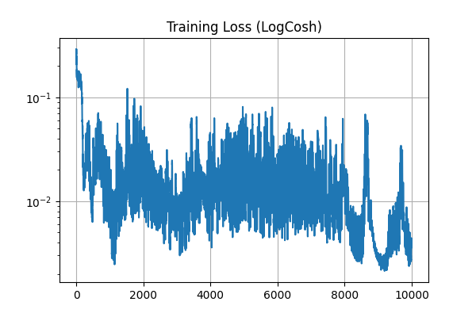
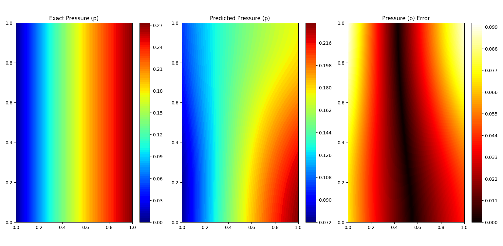
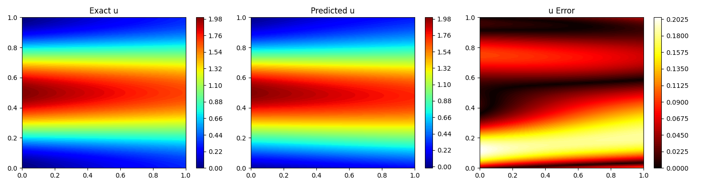
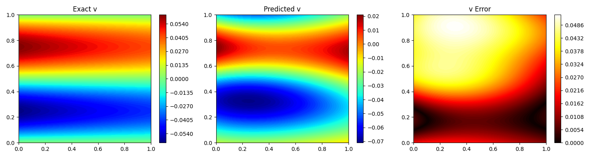

# Navier-Stokes PINN (Kovasznay Flow)

This folder contains a from-scratch Physics-Informed Neural Network (PINN) that solves the steady 2D incompressible Navier-Stokes equations using the Kovasznay analytical solution as ground truth. The implementation is pure NumPy and manually differentiates the network outputs up to third order to compute PDE residuals.

## Overview

- **Target PDE (steady, incompressible):**
  $$
  u u_x + v u_y + p_x - \nu (u_{xx} + u_{yy}) = 0
  $$
  $$
  u v_x + v v_y + p_y - \nu (v_{xx} + v_{yy}) = 0
  $$
  $$
  u_x + v_y = 0
  $$
- **Velocity parameterization:** stream function $\psi$ with
  $$
  u = \psi_y, \quad v = -\psi_x
  $$
- **Exact solution:** Kovasznay flow with
  $$
  \lambda = \frac{Re}{2} - \sqrt{\frac{Re^2}{4} + 4\pi^2}
  $$
  $$
  u(x,y)=1-e^{\lambda x}\cos(2\pi y),\quad v(x,y)=\frac{\lambda}{2\pi}e^{\lambda x}\sin(2\pi y),\quad p(x,y)=\frac{1}{2}(1-e^{2\lambda x})
  $$

## Files

- [main.py](main.py): NumPy PINN implementation with custom forward and backward passes.
- [loss.png](loss.png): Training loss curve example.
- [u.png](u.png), [v.png](v.png), [p.png](p.png): 2D contour comparisons and errors.
- [u_3d.png](u_3d.png), [v_3D.png](v_3D.png), [p_3d.png](p_3d.png): 3D surface comparisons and errors.

## How It Works

- **Network outputs:** $[\psi, p]$ where pressure is predicted up to a constant.
- **Activation:** SiLU (Swish) with analytically derived derivatives up to fourth order for backpropagation through PDE residuals.
- **Loss:** Log-cosh on PDE residuals and boundary condition errors.
- **Training points:**
  - Interior: 1000 random points per epoch.
  - Boundary: 400 random points on the square boundary per epoch.
- **Pressure anchoring:** After prediction, pressure is shifted to match the mean of the exact solution since pressure in incompressible flow is defined up to a constant.

## Quick Start

1. Install dependencies:

```bash
pip install numpy matplotlib
```

2. Run the training script:

```bash
python main.py
```

The script prints loss every 500 epochs and opens figures for 2D and 3D comparisons.

## Key Parameters (edit in [main.py](main.py))

- `epochs = 10000`
- `lr = 3e-3`
- `Re = 100.0` (so $\nu = 1/Re$)
- Network architecture: `PINN([2, 32, 32, 32, 32, 2])`

## Notes

- This is a pedagogical implementation: everything from the activation derivatives to the optimizer is written manually in NumPy.
- The PDE is enforced directly by backpropagating through spatial derivatives computed by the network.
- If you change $Re$ or the architecture, expect the training stability and error patterns to change noticeably.

## Example Outputs








